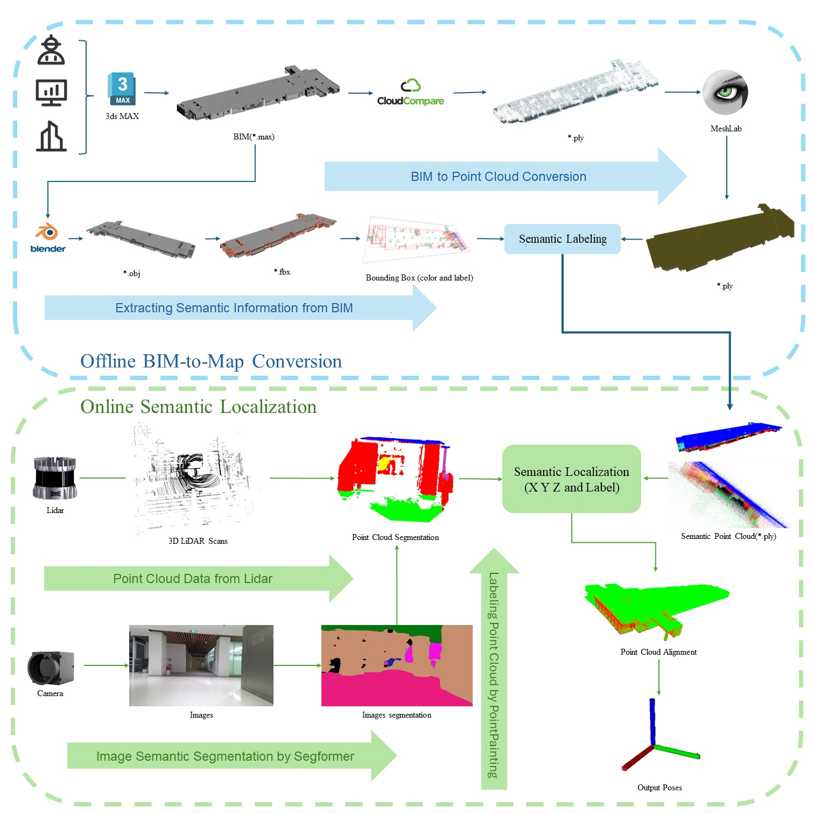
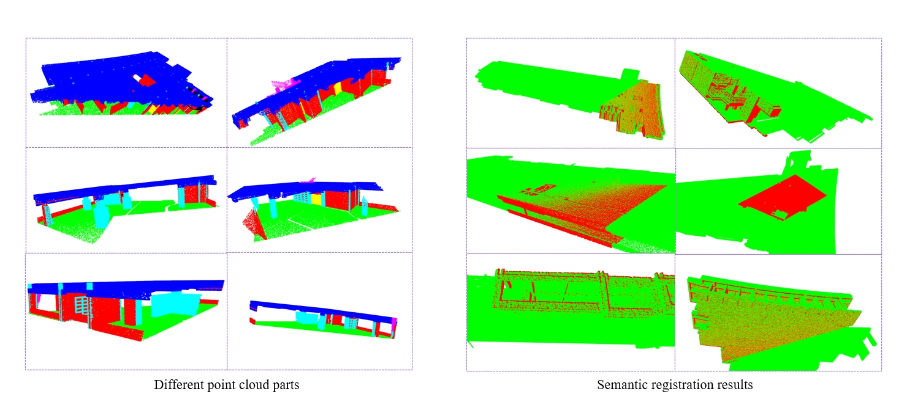

# BIM_localization

This repository contains a seris of Python scripts for point cloud registration based on BIM data.

## Features

- **Comprehensive BIM Import:** Supports importing BIM models in *.max format.
- **Format Conversion:** Utilizes Blender for converting models between different formats such as *.obj and *.fbx.
- **Bounding Box Generation:** Automatically generates bounding boxes for semantic labeling.
- **Point Cloud Generation:** Converts 3D models into point cloud format (*.ply) using [CloudCompare](https://www.danielgm.net/cc/).
- **Mesh Refinement:** Refines point cloud data using [MeshLab](http://www.meshlab.net/) for better mesh representation.
- **Semantic Labeling:** Facilitates semantic labeling of 3D models to identify different parts of the structure.
- **3D Semantic Maps Creation:** Outputs detailed 3D semantic maps in PLY format, which include all semantic labels for further analysis and visualization.


## BIM-to-Map Conversion Pipeline

This pipeline illustrates the process of converting Building Information Modeling (BIM) data into 3D semantic maps, facilitating the generation of labeled 3D models from architectural designs. Below is a step-by-step overview of the conversion process:



1. **[BIM](https://en.wikipedia.org/wiki/Building_information_modeling) (*.max) Import**: The initial architectural model is created and stored in BIM format (*.max). (Set the values for all three rotations to 0)
2. **[Blender](https://www.blender.org/) (*.obj) Conversion**: The BIM model is imported into Blender and converted to the OBJ format (*.obj) for further processing.
3. **[Blender](https://www.blender.org/) (*.fbx) Export**: The model is then exported from Blender in FBX format (*.fbx) to be used in subsequent steps.
4. **Bounding Boxes Generation**: The Blender model is processed to generate bounding boxes which aid in the semantic labeling process.
5. **Point Cloud Generation ([CloudCompare](https://www.danielgm.net/cc/) *.ply)**: Using CloudCompare, the 3D model (*.obj) is converted into a point cloud format (*.ply), which represents the 3D geometry of the structure.
6. **[MeshLab](http://www.meshlab.net/)  (*.ply) Processing**: The point cloud is further processed in MeshLab to refine the 3D mesh representation. (double to float, ACSII, only XYZ)
7. **Semantic Labeling**: The refined mesh undergoes semantic labeling, where different parts of the structure are identified and labeled according to their functions or types.
8. **3D Semantic Maps (*.ply) Creation**: The final output is a 3D semantic map in PLY format, which includes all the semantic labels and can be used for various analytical and visualization purposes.

This conversion process ensures that complex architectural models are transformed into detailed, labeled 3D maps, making them useful for applications in simulation, analysis, and visualization.


## Requirements

- Python 3.x
- Open3D
- NumPy
- FBX
- json
- os, sys

## Getting Started

To get started with the BIM-to-Map conversion pipeline, follow these steps:

1. **Install Required Software:**
    - [Blender 3.6](https://www.blender.org/download/)
    - [MeshLab 2023.12](http://www.meshlab.net/#download)
    - [CloudCompare](https://www.danielgm.net/cc/release/)
    - [3Ds Max 2024](https://www.autodesk.com/products/3ds-max/overview?term=1-YEAR&tab=subscription)

2. **Prepare Your BIM Model:**
   - Create or obtain a BIM model in *.max format.

3. **Convert and Process the Model:**
   - Follow the steps outlined in the pipeline to convert and process your BIM model into a 3D semantic map.

## How to run

edit fbx_file_path = /*.fbx
output: bounding_boxes.txt

```bash
cd ~/your_workspace/BIMconvert
python FBX.py
```

Re-label the structure according to its function or type.
output: consolidated_bounding_boxes.txt

```bash
python rename.py
```

Check bounding boxes for accuracy, categorize and visualize them in different colors

```bash
python visualbox.py
```


Annotate the point cloud by coloring and adding labels, point_cloud_file: *.ply, output: labeled*.ply

```bash
python label.py
```

## Registration for global localization

```bash
python ./tools/register.py
```


# Point cloud semantic segmentation


## Run

1. Prepare an image and a pcd (point cloud) file.
2. Modify the path in the inference file: ```test_point_cloud_0620_single.py```
   ```python
    if __name__ == "__main__":
        trainer = MirrorTrainer(env_type=env,
                                max_epochs=max_epoch,
                                batch_size=batch_size,
                                device=device,
                                logdir=logdir,
                                val_every=val_every,
                                num_gpus=num_gpus,
                                master_port=17752,
                                training_script=__file__)
        
        trainer.run_single_file("/home/xingzhaohu/point_cloud_project/2024_0624_data_test/img/KIN_3828.png", 
                                "/home/xingzhaohu/point_cloud_project/2024_0624_data_test/pcd/KIN_3828.pcd")
    
   ```
3. Run the inference code 
   ```python
   python test_point_cloud_0620_single.py
   ```


## Contributing

Yujie ZHOU, Zhaohu XING, Kai ZHANG

## License

This project is licensed under the MIT License - see the [LICENSE](LICENSE) file for details.

## Contact

For questions or inquiries, please contact [Yujie ZHOU](yzhou118@connect.hkust-gz.edu.cn).

